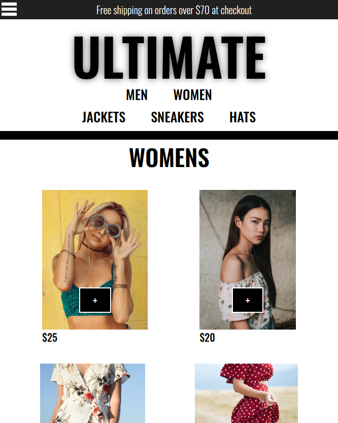

# Ultimate Clothing
* Live version: https://ultimateclothing.now.sh
  * Demo email: tester@gmail.com
  * Demo password: Password1!

* Link to Server Repo: https://github.com/ldail/ultimate-clothing-server
* Link to Client Repo: https://github.com/ldail/ultimate-clothing

  
## Getting Started
* Clone the repository and install dependencies using ```npm install```
* Start the development server using ```npm start```
  
  
## Description
Ultimate Clothing is an e-commerce platform that hosts popular clothing
items for sale. The application utilizes Stripe for payments and Firebase/auth for user authorization and Firebase/firestore for
holding the collection data. Ultimate Clothing utilizes redux for state
management and is a fully functioning e-commerce store.


## Screenshot

#### Collection Page (Women's)



## Technologies
* ReactJS
* Redux
* NodeJS
* Express
* Stripe
* Firebase
* JavaScript
* HTML5
* CSS3